<div align="center">
  

  <h1>Welcome Tajikistan</h1>

  <p>
    타지키스탄 여행 정보를 탐색하고, 저장하고, 일정으로 관리하는 여행 정보 플랫폼
  </p>

  <p>
    
    
    
    
    
  </p>
</div>

---

## Contents

- [Overview](#overview)
- [Highlights](#highlights)
- [Screenshots](#screenshots)
- [Features](#features)
- [Tech Stack](#tech-stack)
- [Architecture](#architecture)
- [Pages](#pages)
- [API](#api)
- [Getting Started](#getting-started)
- [Team](#team)

## Overview

타지키스탄은 파미르 고원, 두샨베, 수그드, 하틀론 등 다양한 자연/문화 관광 자원을 가진 국가입니다. 하지만 국내 사용자 입장에서는 정보가 여러 곳에 흩어져 있고, 언어 장벽도 있어 여행 준비 과정이 쉽지 않습니다.

**Welcome Tajikistan**은 관광지 탐색, 상세 정보 확인, 찜, 리뷰, 챗봇, 긴급 연락처, 여행 캘린더를 하나의 흐름으로 연결한 웹 서비스입니다. 사용자는 관심 장소를 저장하고, 저장한 장소를 캘린더에 배치하며, 날짜별 메모까지 작성할 수 있습니다.

## Highlights

| Area | Description |
| --- | --- |
| Travel Discovery | 지역, 카테고리, 키워드 기반으로 타지키스탄 관광지를 탐색합니다. |
| Personal Planning | 찜한 관광지를 캘린더에 배치하고 날짜별 메모를 작성합니다. |
| Trusted Travel Support | 긴급 연락처와 챗봇을 통해 여행 중 필요한 정보를 빠르게 확인합니다. |
| Multi-language UX | 한국어, 영어, 러시아어, 타지크어 화면 문구를 지원합니다. |
| Authenticated Features | JWT 기반 인증으로 찜, 리뷰, 캘린더 기능을 사용자별로 관리합니다. |

## Screenshots

### Main

타지키스탄의 대표 이미지를 중심으로 서비스의 분위기를 전달하는 첫 화면입니다. 검색, 언어 선택, 주요 메뉴, 챗봇 진입점을 제공합니다.

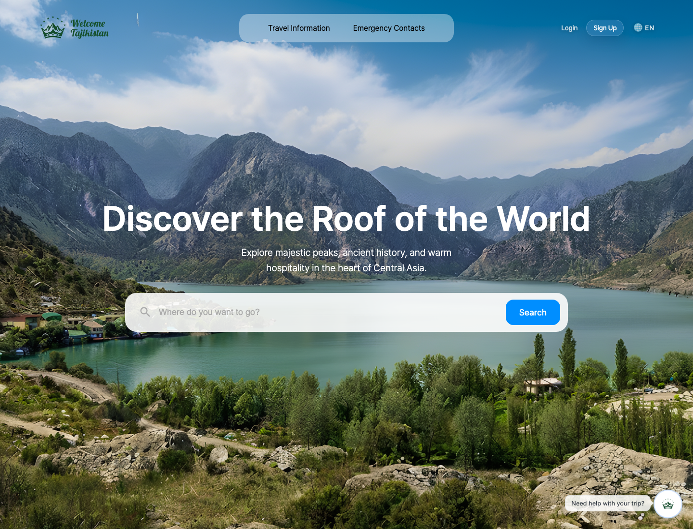

### Search & Filter

관광지를 키워드, 카테고리, 지역 기준으로 검색하고 필터링합니다. 결과 카드는 이미지, 평점, 찜 상태, 지역 정보를 함께 보여줍니다.

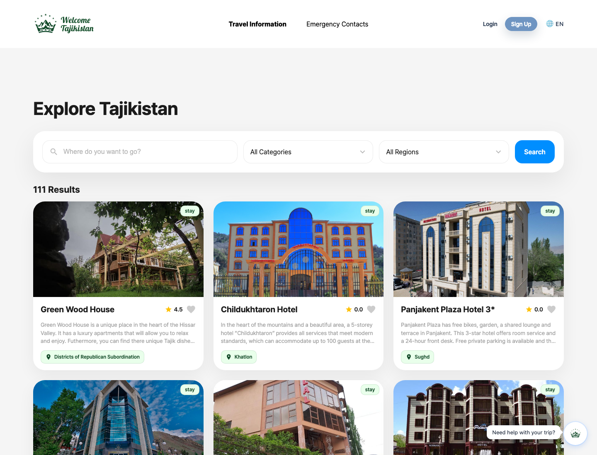

### Place Detail

상세 페이지에서는 관광지 이미지, 지역/카테고리, 평점, 운영 시간, 리뷰 영역을 확인할 수 있습니다.

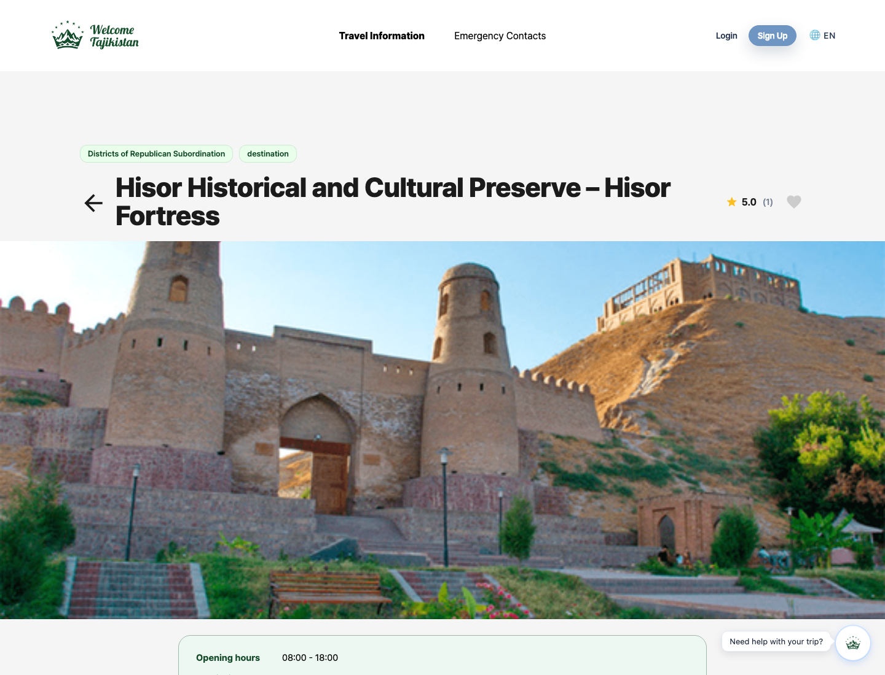

### Chatbot

챗봇은 관광지 추천, 운영 시간, 긴급 연락처 같은 질문에 빠르게 접근할 수 있도록 빠른 질문 버튼과 다국어 전환을 제공합니다.

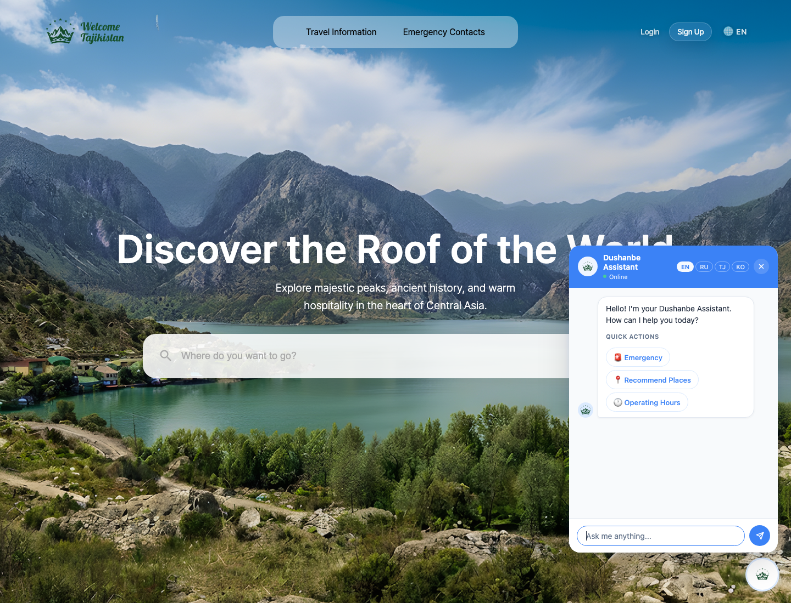

### Calendar Dashboard

찜한 관광지를 일정으로 옮기고, 캘린더 이벤트와 날짜별 메모를 함께 관리하는 여행 대시보드입니다.

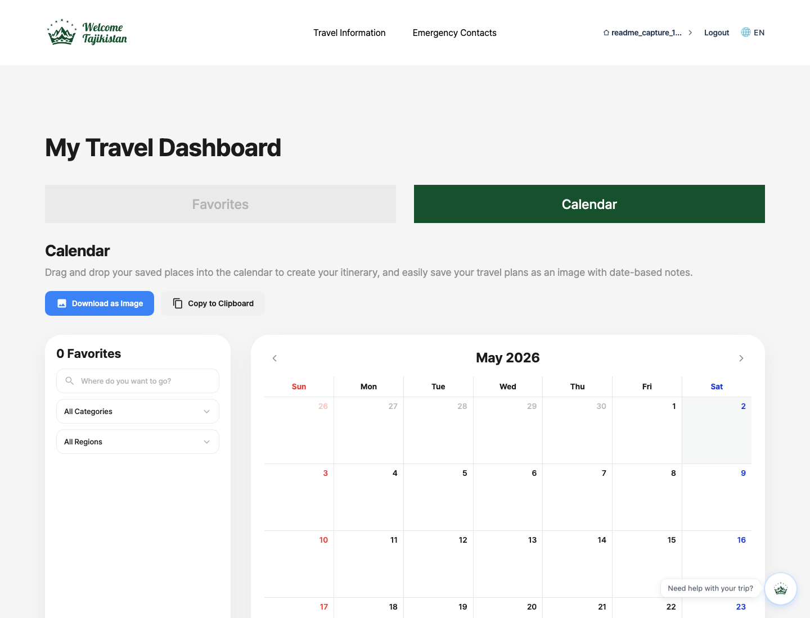

#### Calendar Planning Flow

왼쪽 패널에는 찜한 장소가 카드로 표시되고, 오른쪽에는 월간 캘린더가 표시됩니다. 장소 일정과 메모가 캘린더 이벤트로 함께 노출됩니다.


#### Favorite Filtering

캘린더 안에서도 찜한 장소를 검색어, 카테고리, 지역 기준으로 다시 필터링할 수 있습니다. 일정에 넣을 후보가 많을 때 빠르게 좁혀 볼 수 있습니다.

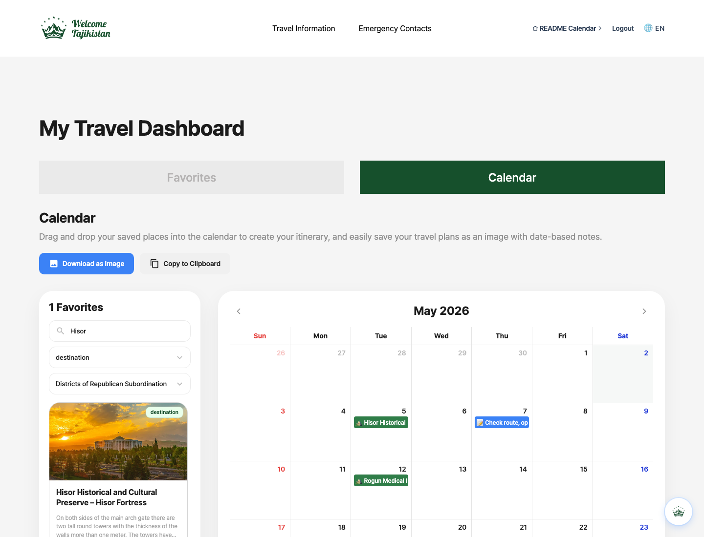

#### Memo Modal

날짜별 여행 준비 사항이나 일정 메모를 작성할 수 있습니다. 저장된 메모는 캘린더 이벤트로 표시됩니다.

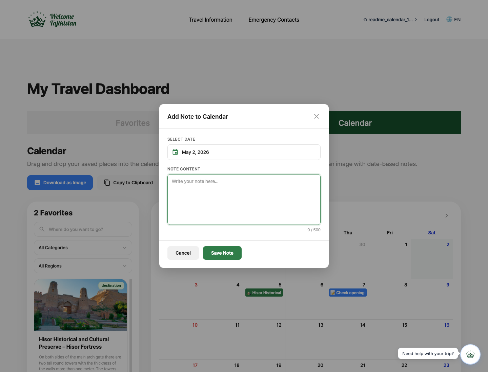

#### Date Picker

메모 작성 시 내장 날짜 선택기를 통해 원하는 날짜를 직접 고를 수 있습니다.

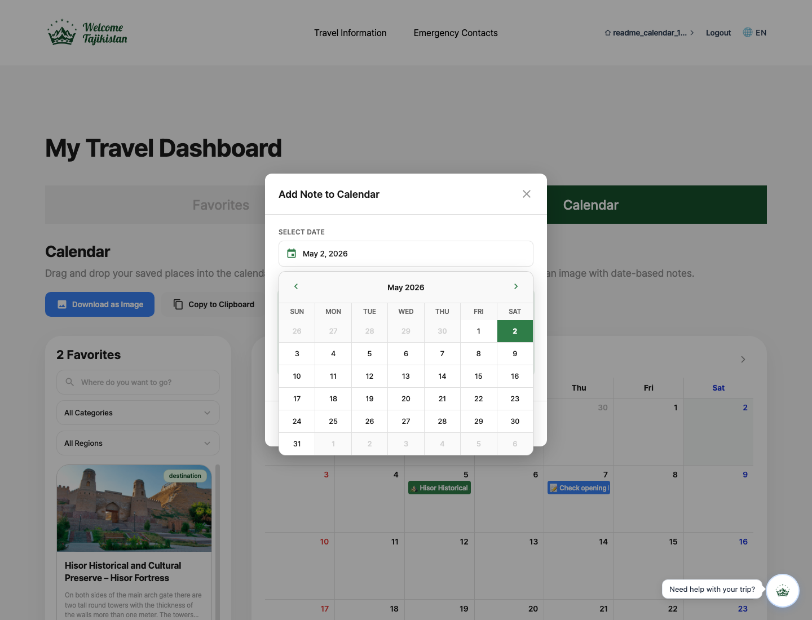

#### Export Calendar

캘린더 화면은 `Download as Image` 버튼으로 PNG 이미지로 저장하거나, `Copy to Clipboard` 버튼으로 클립보드에 복사할 수 있습니다. 발표 자료나 여행 계획 공유용 이미지로 활용할 수 있습니다.

### Emergency Contacts

여행 중 필요한 긴급 연락처를 한 화면에서 확인할 수 있습니다. 경찰, 구급, 소방, 병원, 대사관 연락처를 제공합니다.

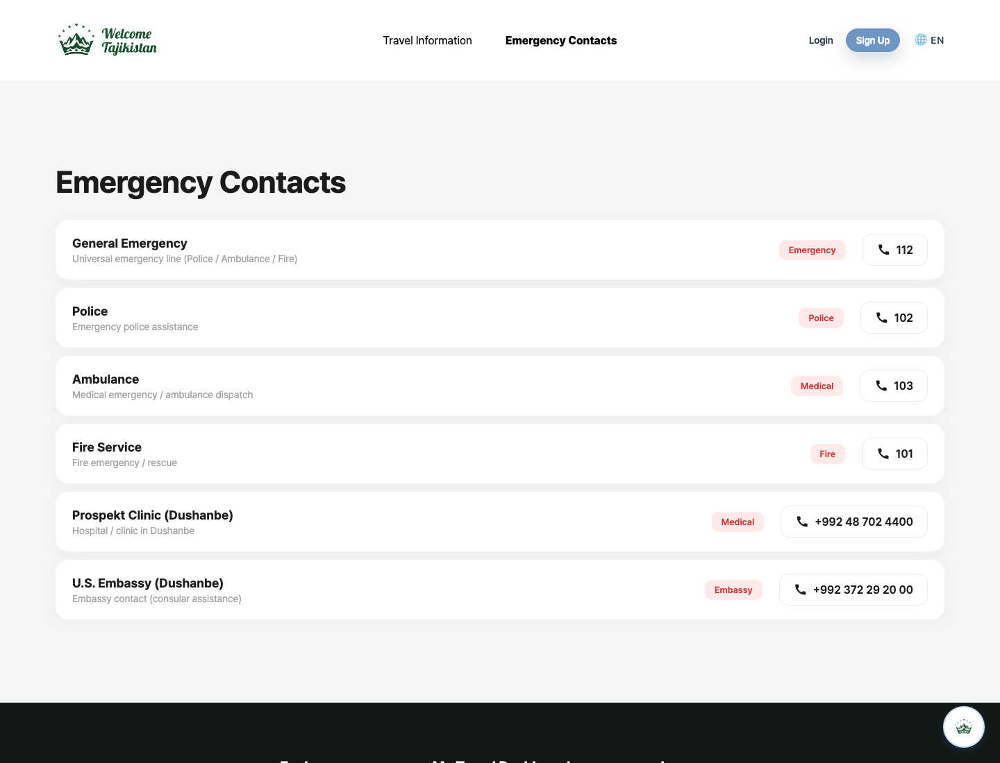

### Authentication

로그인 후 찜, 리뷰, 캘린더 기능을 사용할 수 있습니다.

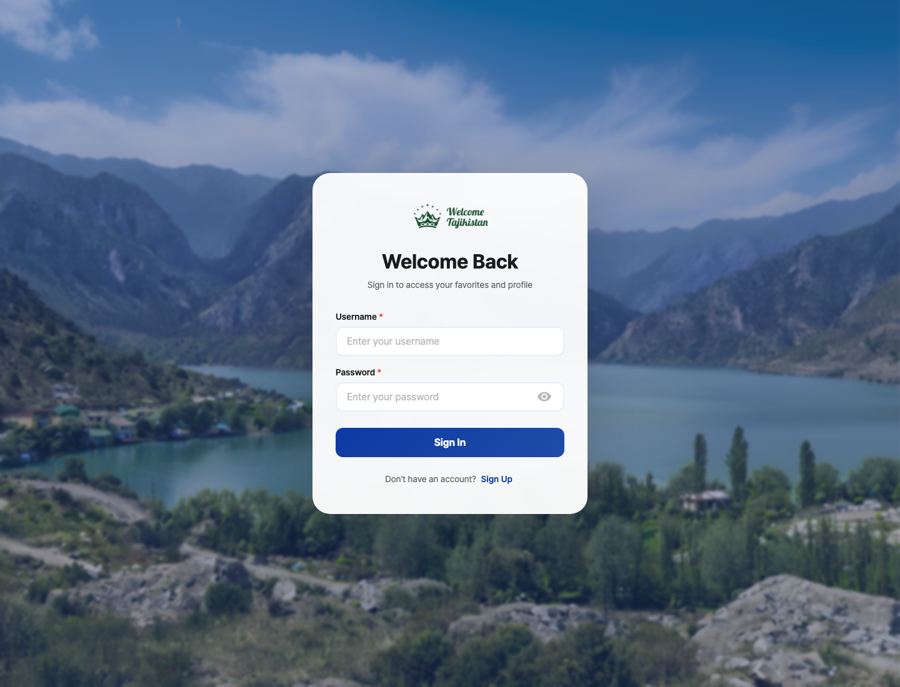

회원가입은 기본 정보와 계정 정보를 2단계로 나누어 입력 부담을 줄였습니다.

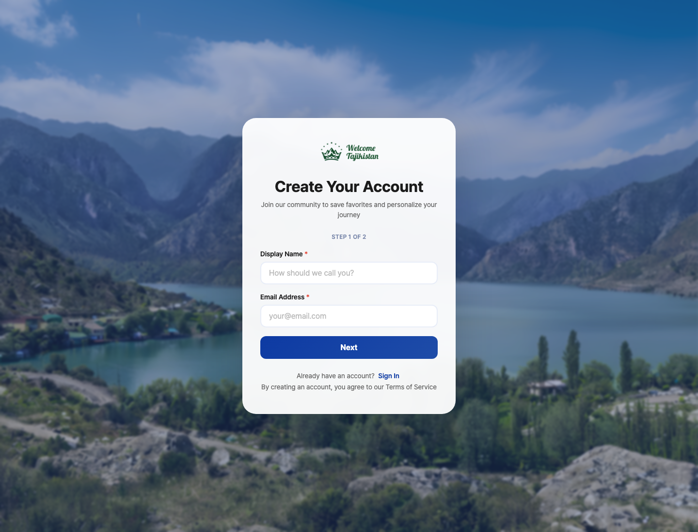

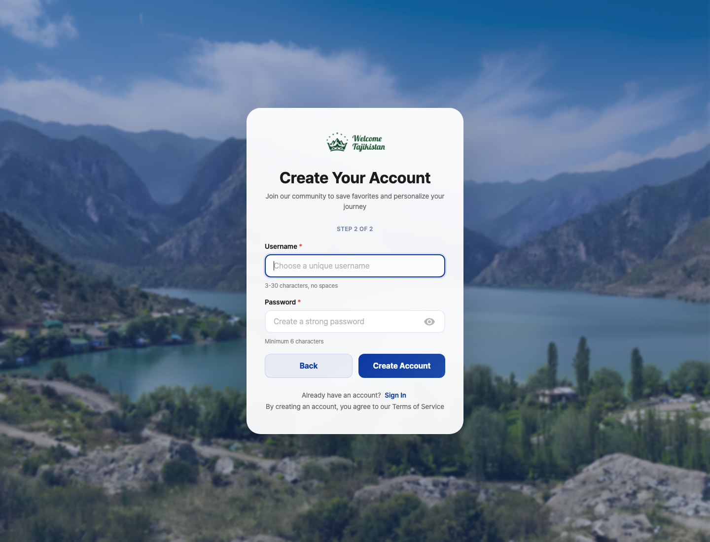

## Features

| Feature | Description |
| --- | --- |
| 관광지 탐색 | 지역/카테고리 기반 관광지 탐색과 키워드 검색을 제공합니다. |
| 검색 및 필터링 | 검색어, 지역, 카테고리 조건을 조합해 관광지를 조회합니다. |
| 상세 정보 | 관광지 이미지, 설명, 지역, 카테고리, 운영 시간, 리뷰를 제공합니다. |
| 찜 | 로그인 사용자가 관심 관광지를 저장하고 목록으로 관리합니다. |
| 리뷰 | 관광지별 리뷰 작성, 조회, 삭제와 평균 평점을 제공합니다. |
| 캘린더 | 찜한 관광지를 날짜별 일정으로 배치하고 저장합니다. |
| 캘린더 메모 | 날짜별 메모를 작성, 수정, 삭제하고 캘린더 이벤트로 표시합니다. |
| 챗봇 | 관광지 추천, 운영 시간, 긴급 연락처 질문에 응답합니다. |
| 긴급 연락처 | 주요 긴급 전화번호와 기관 정보를 제공합니다. |
| 다국어 | 한국어, 영어, 러시아어, 타지크어 메시지를 지원합니다. |
| UX 개선 | 반응형 UI, 스켈레톤 UI, 로딩 스피너를 적용했습니다. |

## Tech Stack

| Layer | Technologies |
| --- | --- |
| Backend | Java 17, eGovFrame Boot 4.3.0, Spring Boot, Spring MVC |
| Security | Spring Security, JWT |
| Database | MySQL, Spring Data JPA |
| Frontend | Thymeleaf, HTML, CSS, JavaScript |
| Calendar | FullCalendar |
| Chatbot | OpenAI API, RAG context, template fallback |
| Translation | DeepL API |
| Documentation | Springdoc OpenAPI UI |
| Build | Maven |

## Architecture

```text
src/main/java/egovframework/example
├── chatbot        # 챗봇 도메인, 서비스, RAG, LLM 연동, 컨트롤러
├── config         # 보안, OpenAPI, 초기 데이터 설정
├── controller     # 화면/REST 컨트롤러
├── domain         # JPA 엔티티
├── dto            # 요청/응답 DTO
├── global         # 전역 예외 처리
├── repository     # JPA Repository
├── security       # JWT 인증 필터
├── service        # 비즈니스 로직
└── util           # JWT, 토큰 유틸

src/main/resources
├── static         # CSS, JS, 이미지, 로고, 폰트
├── templates      # Thymeleaf 화면 템플릿
├── messages*.properties
├── application.yaml
└── yaml/application-keys.yaml
```

## Pages

| Path | Description |
| --- | --- |
| `/` | 메인 페이지 |
| `/filter` | 관광지 검색/필터 페이지 |
| `/detail/{id}` | 관광지 상세 페이지 |
| `/emergency_contacts` | 긴급 연락처 페이지 |
| `/auth/login` | 로그인 페이지 |
| `/auth/signup` | 회원가입 페이지 |
| `/me/favorites` | 찜한 관광지 페이지 |
| `/me/calendar` | 여행 캘린더 페이지 |

## API

| Method | Path | Description |
| --- | --- | --- |
| `POST` | `/auth/signup` | 회원가입 |
| `POST` | `/auth/login` | 로그인 |
| `POST` | `/auth/refresh` | 토큰 재발급 |
| `POST` | `/auth/logout` | 로그아웃 |
| `POST` | `/me/favorite/add/{placeId}` | 찜 추가 |
| `DELETE` | `/me/favorite/delete/{placeId}` | 찜 삭제 |
| `GET` | `/me/favorite/list` | 내 찜 목록 조회 |
| `POST` | `/api/reviews` | 리뷰 작성 |
| `GET` | `/api/reviews/{placeId}` | 관광지 리뷰 조회 |
| `DELETE` | `/api/reviews/{reviewId}` | 리뷰 삭제 |
| `POST` | `/me/calendar/add` | 캘린더 일정 추가 |
| `GET` | `/me/calendar/list` | 내 캘린더 일정 조회 |
| `DELETE` | `/me/calendar/delete/{calendarId}` | 캘린더 일정 삭제 |
| `POST` | `/me/calendar-memo/save` | 캘린더 메모 저장 |
| `GET` | `/me/calendar-memo/list` | 내 메모 목록 조회 |
| `PUT` | `/me/calendar-memo/{memoId}` | 메모 수정 |
| `DELETE` | `/me/calendar-memo/{memoId}` | 메모 삭제 |
| `POST` | `/api/chat` | 챗봇 질문 요청 |

## Getting Started

### Prerequisites

- Java 17
- Maven
- MySQL 8.x

### Configuration

`src/main/resources/application.yaml`은 `classpath:/yaml/application-keys.yaml`을 import합니다. 로컬 실행 전 아래 파일을 환경에 맞게 준비합니다.

```yaml
# src/main/resources/yaml/application-keys.yaml
spring:
  datasource:
    url: jdbc:mysql://localhost:3306/tajikistan_travel
    username: your_username
    password: your_password
    driver-class-name: com.mysql.cj.jdbc.Driver

deepl:
  api-key: your_deepl_api_key

chatbot:
  llm:
    mode: openai
    api-key: your_openai_api_key
```

> 실제 DB 비밀번호, OpenAI API 키, DeepL API 키는 공개 저장소에 커밋하지 않는 것을 권장합니다.

### Run

```bash
mvn spring-boot:run
```

기본 포트는 `8080`입니다.

```text
http://localhost:8080
```

### Test

```bash
mvn test
```

## Implementation Notes

- 관광지 데이터는 `TourPlace`, `TourPlaceI18n`, `CategoryCode`, `RegionCode`, `Image` 엔티티를 중심으로 관리합니다.
- 회원 인증은 Spring Security와 JWT 필터를 통해 처리합니다.
- 찜, 리뷰, 캘린더, 메모 기능은 로그인 사용자의 member id를 기준으로 동작합니다.
- 챗봇은 사용자 메시지를 정규화하고 의도를 분류한 뒤, 관광지/운영 시간/긴급 연락처 데이터를 조회해 응답합니다.
- LLM 응답은 RAG 컨텍스트와 검증 로직을 거쳐, 실패 시 템플릿 기반 답변으로 대체됩니다.
- 다국어 화면 문구는 `messages_ko.properties`, `messages_en.properties`, `messages_ru.properties`, `messages_tg.properties`로 관리합니다.

## Team

| Name | GitHub | Main Contributions |
| --- | --- | --- |
| 종혜 | [jonghyekim](https://github.com/jonghyekim) | 챗봇 프론트 디자인 및 백엔드 연동, 반응형 구현, 데이터 크롤링, 검색 및 필터링 |
| 종운 | [jwoon0606](https://github.com/jwoon0606) | 챗봇 백엔드, 로그인/회원가입 프론트, 반응형 수정, 스켈레톤 UI, 페이징 |
| 조이 | [devpjoy](https://github.com/devpjoy) | 캘린더 기능, 웹사이트 디자인, 페이지별 초기 프론트 구축, ERD 변경사항 프론트 반영 |
| 현아 | [Hyunaaah](https://github.com/Hyunaaah) | 데이터 크롤링 및 DB 업로드, 회원가입/로그인 백엔드, 찜, 리뷰 작성, 로딩 스피너, 캘린더 메모 |

## License

This project is based on the Apache License 2.0 license configuration inherited from the eGovFrame project template.
